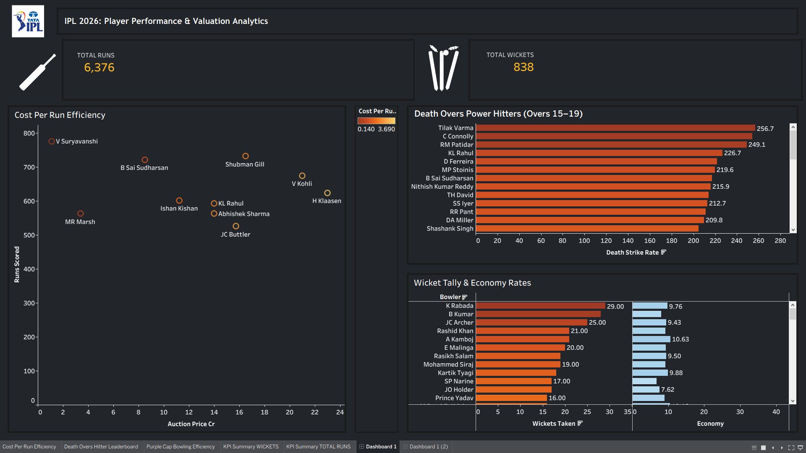

```markdown
# IPL 2026: Player Performance & Valuation Analytics

An end-to-end sports data analytics project evaluating the IPL 2026 season. This project bridges player auction valuation (financial ROI) with high-pressure death-over batting performance and dual-axis bowling efficiency to deliver actionable insights for team purse allocation and performance analysis.

---

## 📊 Interactive Dashboard Preview

👉 **[Click Here to View the Live Dashboard on Tableau Public](https://public.tableau.com/app/profile/avdhut.madan/viz/IPL2026PlayerPerformanceValuationAnalytics/Dashboard1)**



---

## 💡 Key Analytical Insights Derived

### 1. Financial ROI & Cost Efficiency (Scatter Plot)
* **Bargain Performance**: **Vaibhav Suryavanshi** stood out as the highest ROI acquisition, delivering **770+ total runs** at a minimal auction price of **₹0.14 Cr**, yielding an exceptionally low Cost-per-Run metric.
* **Marquee Performance**: **Virat Kohli** and **Heinrich Klaasen** delivered strong run totals (~650+ and ~620+ runs respectively) but required premium auction/retention investments (₹20+ Cr tier).
* **Mid-Tier Value**: **B Sai Sudharsan** (~722 runs at ₹8.5 Cr) and **Shubman Gill** (~732 runs at ₹16.5 Cr) proved to be balanced mid-tier performers balancing price with output.

### 2. High-Pressure Clutch Hitting (Death Overs Leaderboard)
* **Closing Over Dominance**: Filtering for players facing a minimum of 30 legal balls in Overs 15–19, **Tilak Varma** led the entire tournament with a strike rate of **256.7**.
* **Primary Death Hitters**: **C. Connolly** (**254.1 SR**) and **Rajat Patidar** (**249.1 SR**) rounded out the top 3 power-hitters under pressure.

### 3. Bowling Wicket Tally & Economy Control (Purple Cap Efficiency)
* **Purple Cap Winner**: **Kagiso Rabada** secured the top bowling mark with **29.00 wickets** while maintaining a 9.76 economy rate.
* **Economical Strike Bowlers**: **Bhuvneshwar Kumar** delivered high impact with **28.00 wickets** at a disciplined **8.00 Economy Rate**, offering the best strike-to-economy balance.

---

## 🛠️ Project Data Architecture

```text
 Raw Delivery & Auction CSVs
            │
            ▼
 Python, Pandas & SQL Data Cleaning & Aggregation
            │
            ▼
 Multi-CSV Data Model (Tableau Relationships)
            │
            ▼
 Interactive Dark-Mode Tableau Executive Dashboard

```

1. **`ipl_2026_batting_roi.csv`**: Contains player auction prices, total runs, and calculated cost-per-run metrics.
2. **`ipl_2026_death_overs.csv`**: Contains ball-by-ball death over aggregates (Overs 15–19, minimum 30 balls filter).
3. **`ipl_2026_bowling_summary.csv`**: Contains total wickets, overs bowled, and economy rates.

---

## 💻 Tech Stack & Skills Demonstrated

* **Data Wrangling & Analytics**: Python (`pandas`, `numpy`), SQL / PostgreSQL logic
* **Data Visualization**: Tableau Public Desktop
* **Dashboard Design**: Dark theme customization (`#1E1E2E`), container architecture, zero-padding alignment, custom iconography
* **Interactivity**: Cross-sheet filter action triggers on player selection

---

## 📁 Repository Structure

```text
├── data/
│   ├── ipl_2026_batting_roi.csv
│   ├── ipl_2026_bowling_summary.csv
│   └── ipl_2026_death_overs.csv
├── tableau/
│   └── IPL_2026_Analytics.twbx
├── assets/
│   └── dashboard_preview.png
└── README.md

```

```

```
